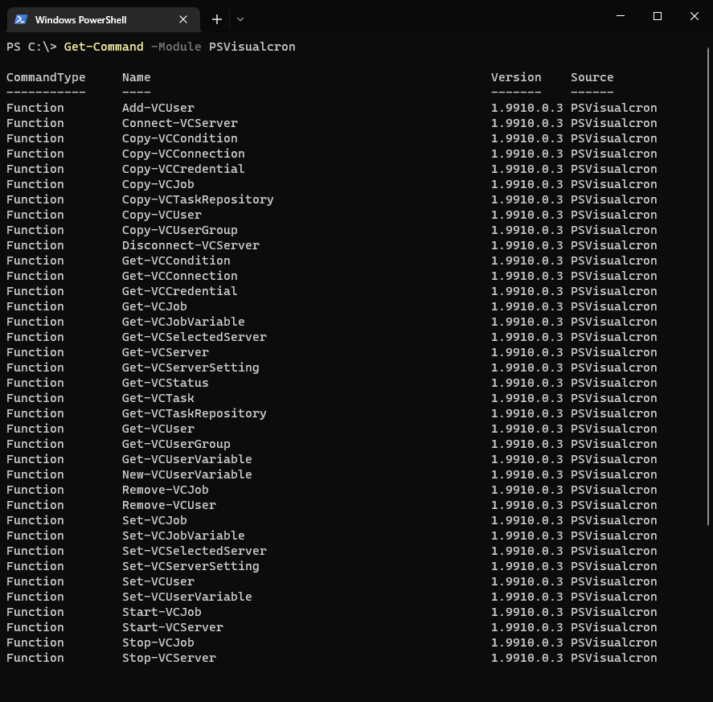

## ABOUT

PSVisualCron is a Powershell module for managing VisualCron Servers.<br>
VisualCron is a Job Schedulling software for windows based computers.<br>
With this software it is possible to automate nearly everything, without having to write 1 line of code, everything is GUI based.
<br>
**So where is the fun in that?**<br><br>
Therefore you can start coding again, using this powershell module.
<br>
If you want more informations about VisualCron and its endless possibilities,<br>
visit the vendors website, just keep in mind, that this is a payed software.<br>
https://www.visualcron.com/
<br><h3>Supported Version: 9.9.10<h3>
<br>
## INSTALLATION

```powershell
Install-Module PSVisualCron
```

Link to PowershellGallery: https://www.powershellgallery.com/packages/PSVisualCron

<br><br><br>
## DESCRIPTION

Powershellmodule to manage VisualCron Servers.<br>
Supported Commands:<br>
<br>



## USAGE

Connect to local VC Server using current Session Credentials
```
PS C:\Users\lhgsct3_adm> Connect-VCServer

ID Name             Server           Connected
-- ----             ------           ---------
1  VCServer1                         True
```
Connect remote VC Server using current Session Credentials
```
PS C:\Users\lhgsct3_adm> Connect-VCServer -Computername lhgsverpapp02

ID Name             Server           Connected
-- ----             ------           ---------
2  VCServer2        lhgsverpapp02    True
```
Connect-VCServer Using lokal VC User Credentials
```
PS C:\Users\lhgsct3_adm> Connect-VCServer -Username "test" -Password "test"

ID Name             Server           Connected
-- ----             ------           ---------
1  VCServer1                         True
```
Get all Jobs on Server
```
PS C:\Users\lhgsct3_adm> Get-VCJob

Name             Group
----             -----
Backup settings  Default group
Delete old lo... Default group
Monitor bshell   SYSOP
104 104_COM_I... Infor LN
Server mainte... SYSOP
```
Get specific Job on Server by Name
```
PS C:\Users\lhgsct3_adm> Get-VCJob -Name "Perform Maintenance Mode"

Name             Group
----             -----
Perform Maint... Maintenance Mode
```
Get all Tasks of Job
```
PS C:\Users\lhgsct3_adm> Get-VCJob -Name "Perform Maintenance Mode" | Get-VCTask

Order Name             TaskType
----- ----             --------
1     Send Maintena... Email
2     Set VC Mainte... VariableSet
3     Set-FireWallR... JobTaskControl
4     VC - Server O... JobTaskControl
5     Cleanup Windo... JobTaskControl
6     Cleanup IT-Temp  JobTaskControl
7     Cleanup IT-Log   JobTaskControl
8     Cleanup BSE-tmp  JobTaskControl
9     Cleanup BSE-t... JobTaskControl
10    Cleanup BSE-log  JobTaskControl
11    Cleanup BSE-l... JobTaskControl
12    Cleanup BSE-c... JobTaskControl
13    Cleanup Apach... JobTaskControl
14    Cleanup Apach... JobTaskControl
15    Cleanup LHG E... JobTaskControl
16    Cleanup LHG E... JobTaskControl
23    Autoboot Serv... JobTaskControl
```
